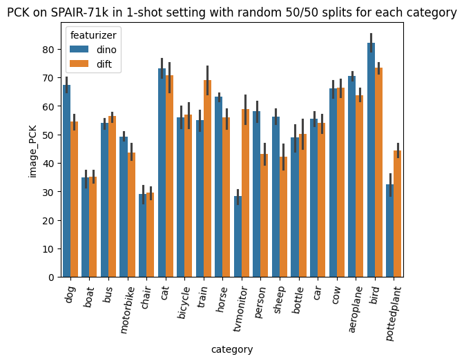

# Few-shot keypoint detection using pretrained feature models

Comparing the different featurizers on SPAIR:



## Tests

Regression tests for the matcher and the crop geometry live in `tests/`. They use plain asserts, so they run
without pytest installed:

```
python tests/test_matcher.py
python tests/test_crop_transform.py
```

(they are also plain pytest test functions, so `uv add --dev pytest && uv run pytest` works too.)
